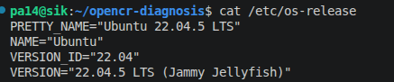
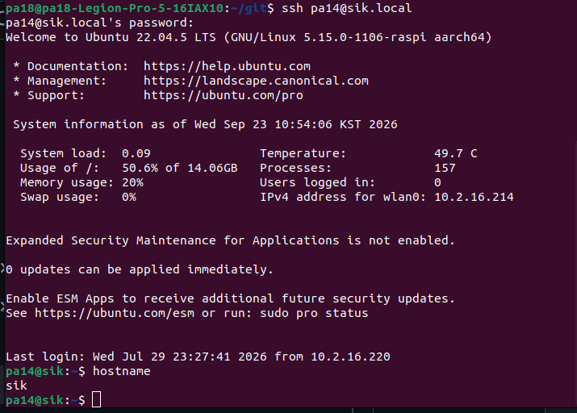
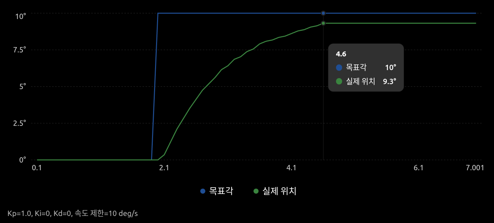
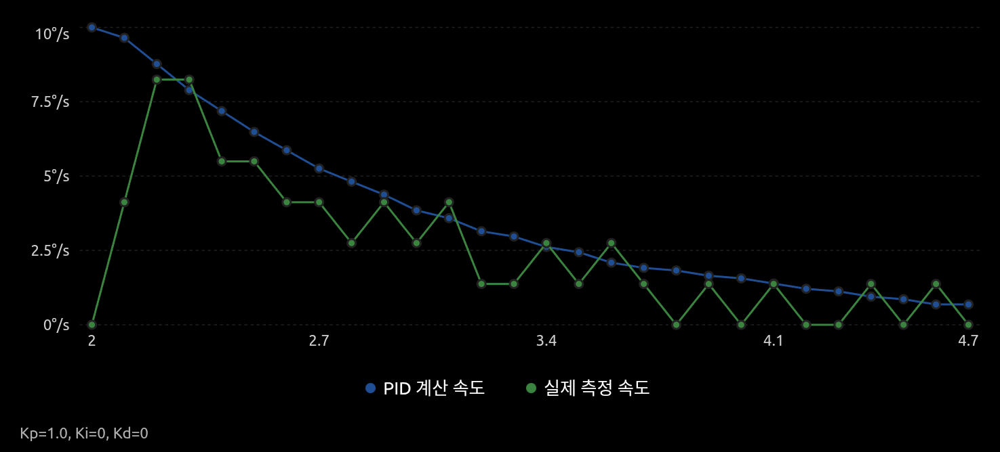

문제 1부터 순서대로 표/구조도/해석 작성
설명은 A4 약 2쪽분량
실행A/B의 로그/캡처는 lv2_module1/results/에 넣고 report.md에서 연결

제출 태그: lv2-module1-submit

## 문제 1. 목표 입력과 응답 확인
### 제출 증거
#### 환경

```
$cat /etc/os-release # 라즈베리파이 OS
PRETTY_NAME="Ubuntu 22.04.5 LTS"
$uname -m # CPU 아키텍처
aarch64
$ls -l /dev/ttyACM* # OpenCR 포트 확인(/dev/ttyACM0)
crw-rw---- 1 root dialout 166, 0 Sep 23 10:12 /dev/ttyACM0
$groups # aialout 포트권한 확인 -> sudo없이 포트접근가능
pa14 adm dialout cdrom floppy sudo audio dip video plugdev netdev lxd
```
#### SSH 접속
pa18노트북에서 user:pa14, 호스트이름:sik인 라즈베리파이pc에 접속

```
pa18@pa18-Legion-Pro-5-16IAX10:~/git$ ssh pa14@sik.local
pa14@sik.local's password: 
Welcome to Ubuntu 22.04.5 LTS (GNU/Linux 5.15.0-1106-raspi aarch64)
...

pa14@sik:~$ hostname
sik
```
#### OpenCR 펌웨어 업로드 확인
```
pa14@sik:~/opencr-diagnosis$ UPLOADER="$BASE/uploader-src/arduino/opencr_develop/opencr_ld/opencr_ld"
set -o pipefail
"$UPLOADER" "$PORT" 115200 \
  "$BASE/output/opencr_position_p.ino.bin" 1 \
  2>&1 | tee "$BASE/upload.log"
opencr_ld ver 1.0.4
opencr_ld_main 
>>
file name : /home/pa14/pa-opencr-build/output/opencr_position_p.ino.bin 
file size : 102 KB
Open port OK
Clear Buffer Start
Clear Buffer End
Board Name : OpenCR R1.0
Board Ver  : 0x17020800
Board Rev  : 0x00000000
>>
flash_erase : 0 : 0.860000 sec
flash_write : 0 : 1.174000 sec 
CRC OK 9B81E2 9B81E2 0.003000 sec
[OK] Download 
jump_to_fw 
jump finished
```
#### 실행 로그
```
pa14@sik:~/opencr-diagnosis$ ls -l /dev/ttyACM*
PORT=/dev/ttyACM0
python3 -m serial.tools.miniterm "$PORT" 115200 --eol LF -e
crw-rw---- 1 root dialout 166, 0 Sep 23 11:22 /dev/ttyACM0
--- Miniterm on /dev/ttyACM0  115200,8,N,1 ---
--- Quit: Ctrl+] | Menu: Ctrl+T | Help: Ctrl+T followed by Ctrl+H ---
help
Invalid setting. Finite Kp, positive speed or max, angle -90..90. Use k/v/a or s <Kp> <speed_deg_s|max> <angle_deg>.
```
#### 실행 목표 변경 후 5행 이상의 실행 A기록과 정지 확인
```
s 1 max 10
START: current position = 0 deg.
P SET Kp=1.0000, Ki=0.0000, Kd=0.0000, speed_limit_deg_s=max, angle_deg=10.000
Run timeout [s]: 60.0
target_deg:0.000        position_deg:0.000      error_deg:0.000 p_deg_s:0.000   i_deg_s:0.000   d_deg_s:0.000pid_deg_s:0.000 speed_deg_s:0.000       u_deg_s:0.000   v_limit_deg_s:-1.000    dt_ms:10.000    kp:1.0000   ki:0.0000        kd:0.0000       t_s:0.100
...

target_deg:10.000       position_deg:0.000      error_deg:10.000        p_deg_s:10.000  i_deg_s:0.000   d_deg_s:0.000        pid_deg_s:10.000        speed_deg_s:0.000       u_deg_s:9.618   v_limit_deg_s:-1.000    dt_ms:10.000 kp:1.0000       ki:0.0000       kd:0.0000       t_s:2.000
target_deg:10.000       position_deg:0.791      error_deg:9.209 p_deg_s:9.209   i_deg_s:0.000   d_deg_s:0.000pid_deg_s:9.209 speed_deg_s:8.244       u_deg_s:9.618   v_limit_deg_s:-1.000    dt_ms:10.000    kp:1.0000   ki:0.0000        kd:0.0000       t_s:2.100
target_deg:10.000       position_deg:1.758      error_deg:8.242 p_deg_s:8.242   i_deg_s:0.000   d_deg_s:0.000pid_deg_s:8.242 speed_deg_s:8.244       u_deg_s:8.244   v_limit_deg_s:-1.000    dt_ms:10.000    kp:1.0000   ki:0.0000        kd:0.0000       t_s:2.200
target_deg:10.000       position_deg:2.549      error_deg:7.451 p_deg_s:7.451   i_deg_s:0.000   d_deg_s:0.000pid_deg_s:7.451 speed_deg_s:6.870       u_deg_s:6.870   v_limit_deg_s:-1.000    dt_ms:10.000    kp:1.0000   ki:0.0000        kd:0.0000       t_s:2.300
target_deg:10.000       position_deg:3.252      error_deg:6.748 p_deg_s:6.748   i_deg_s:0.000   d_deg_s:0.000pid_deg_s:6.748 speed_deg_s:6.870       u_deg_s:6.870   v_limit_deg_s:-1.000    dt_ms:10.000    kp:1.0000   ki:0.0000        kd:0.0000       t_s:2.400
```
정지 확인
```
xtarget_deg:10.000      position_deg:6.416      error_deg:3.584 p_deg_s:3.584   i_deg_s:0.000   d_deg_s:0.000pid_deg_s:3.584 speed_deg_s:1.374       u_deg_s:4.122   v_limit_deg_s:-1.000    dt_ms:10.000    kp:1.0000   ki:0.0000        kd:0.0000       t_s:3.000
STOP: user
```
### 평가
#### 값과 단위 구분
- target_deg:10.000\
    목표 각도, degree
- position_deg:3.252\
    현재 측정 각도, degree
- error_deg:6.748\
    오차 각도, degree
- p_deg_s:6.748\
    P제어 속도, degree/s
- i_deg_s:0.000\
    I제어 속도, degree/s
- d_deg_s:0.000\
    D제어 속도, degree/s
- pid_deg_s:6.748\
    P+I+D 속도, degree/s
- speed_deg_s:6.870\
    실제각속도, degree/s
- u_deg_s:6.870\
    변환된 모터제어속도, degree/s
- v_limit_deg_s:-1.000\
    제한속도, degree/s (-1:제한없음?)
- dt_ms:10.000\
    제어 루프 한 번의 시간 간격, ms
- kp:1.0000\
    P 제어 비례 이득, 1/s
- ki:0.0000\
    I 제어 비례 이득, 1/s*s
- kd:0.0000\
    D 제어 비례 이득, ?
- t_s:2.400\
    시간, 초
#### 그래프 관찰

전형적인 1차시스템의 그래프를 보인다.
0.684의 정상상태오차를 확인할수있다.

외에도 PID제어값과 실제 모터속도를 비교해볼수있다.

## 문제2
### 실행 A의 초기·중간·마지막 시점에서 목표각과 현재각을 선택하고 오차 = 목표각 - 현재각을 계산
|시점|목표각|현재각|오차각|
|---|---|---|---|
|초기|t=2.0|10.000°|0.000°|10.000°|
|중간|t=3.3|10.000°|7.031°|2.969°|
|마지막|t=4.7|10.000°|9.316°|0.684°|

시점은 50%지만 이미 안정값의 75%가량 위치해있다.

목표에 도달할수록 속도가 느려지며 목표값에 도달함을 알수있다.

### 위치 측정 센서와 통신 경로
