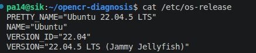
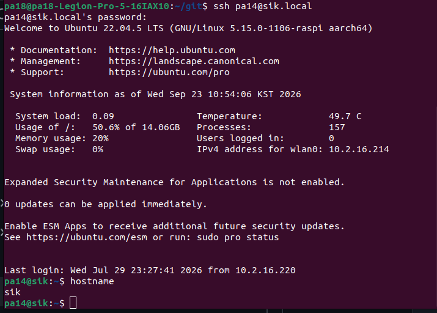
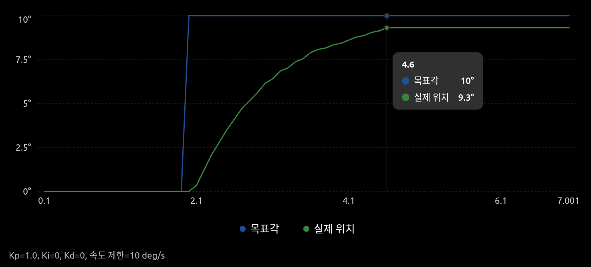
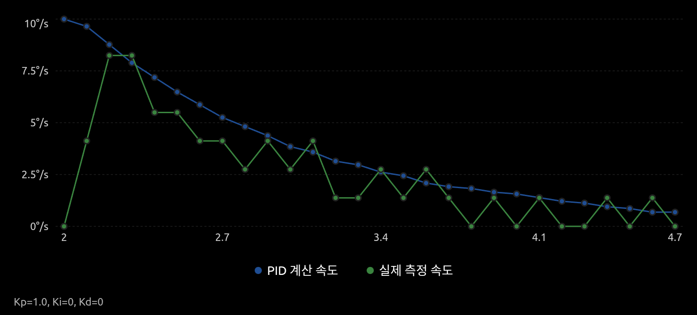
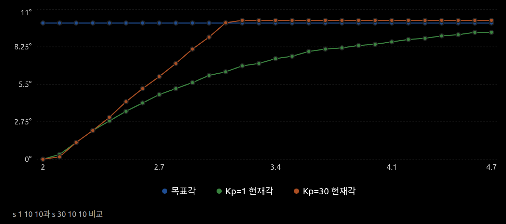

문제 1부터 순서대로 표/구조도/해석 작성
설명은 A4 약 2쪽분량
실행A/B의 로그/캡처는 lv2_module1/results/에 넣고 report.md에서 연결

제출 태그: lv2-module1-submit

## 문제 1. 목표 입력과 응답 확인
### 제출 증거
#### 환경

```
$cat /etc/os-release # 라즈베리파이 OS
PRETTY_NAME="Ubuntu 22.04.5 LTS"
$uname -m # CPU 아키텍처
aarch64
$ls -l /dev/ttyACM* # OpenCR 포트 확인(/dev/ttyACM0)
crw-rw---- 1 root dialout 166, 0 Sep 23 10:12 /dev/ttyACM0
$groups # aialout 포트권한 확인 -> sudo없이 포트접근가능
pa14 adm dialout cdrom floppy sudo audio dip video plugdev netdev lxd
```
#### SSH 접속
pa18노트북에서 user:pa14, 호스트이름:sik인 라즈베리파이pc에 접속

```
pa18@pa18-Legion-Pro-5-16IAX10:~/git$ ssh pa14@sik.local
pa14@sik.local's password: 
Welcome to Ubuntu 22.04.5 LTS (GNU/Linux 5.15.0-1106-raspi aarch64)
...

pa14@sik:~$ hostname
sik
```
#### OpenCR 펌웨어 업로드 확인
```
pa14@sik:~/opencr-diagnosis$ UPLOADER="$BASE/uploader-src/arduino/opencr_develop/opencr_ld/opencr_ld"
set -o pipefail
"$UPLOADER" "$PORT" 115200 \
  "$BASE/output/opencr_position_p.ino.bin" 1 \
  2>&1 | tee "$BASE/upload.log"
opencr_ld ver 1.0.4
opencr_ld_main 
>>
file name : /home/pa14/pa-opencr-build/output/opencr_position_p.ino.bin 
file size : 102 KB
Open port OK
Clear Buffer Start
Clear Buffer End
Board Name : OpenCR R1.0
Board Ver  : 0x17020800
Board Rev  : 0x00000000
>>
flash_erase : 0 : 0.860000 sec
flash_write : 0 : 1.174000 sec 
CRC OK 9B81E2 9B81E2 0.003000 sec
[OK] Download 
jump_to_fw 
jump finished
```
#### 실행 로그
```
pa14@sik:~/opencr-diagnosis$ ls -l /dev/ttyACM*
PORT=/dev/ttyACM0
python3 -m serial.tools.miniterm "$PORT" 115200 --eol LF -e
crw-rw---- 1 root dialout 166, 0 Sep 23 11:22 /dev/ttyACM0
--- Miniterm on /dev/ttyACM0  115200,8,N,1 ---
--- Quit: Ctrl+] | Menu: Ctrl+T | Help: Ctrl+T followed by Ctrl+H ---
help
Invalid setting. Finite Kp, positive speed or max, angle -90..90. Use k/v/a or s <Kp> <speed_deg_s|max> <angle_deg>.
```
#### 실행 목표 변경 후 5행 이상의 실행 A기록과 정지 확인
```
s 1 10 10
START: current position = 0 deg.
P SET Kp=1.0000, Ki=0.0000, Kd=0.0000, speed_limit_deg_s=10, angle_deg=10.000
Run timeout [s]: 60.0
target_deg:0.000        position_deg:0.000      error_deg:0.000 p_deg_s:0.000   i_deg_s:0.000   d_deg_s:0.000pid_deg_s:0.000 speed_deg_s:0.000       u_deg_s:0.000   v_limit_deg_s:10.000    dt_ms:10.000    kp:1.0000   ki:0.0000        kd:0.0000       t_s:0.100
...

target_deg:10.000       position_deg:0.000      error_deg:10.000        p_deg_s:10.000  i_deg_s:0.000   d_deg_s:0.000        pid_deg_s:10.000        speed_deg_s:0.000       u_deg_s:9.618   v_limit_deg_s:10.000    dt_ms:10.000 kp:1.0000       ki:0.0000       kd:0.0000       t_s:2.000
target_deg:10.000       position_deg:0.791      error_deg:9.209 p_deg_s:9.209   i_deg_s:0.000   d_deg_s:0.000pid_deg_s:9.209 speed_deg_s:8.244       u_deg_s:9.618   v_limit_deg_s:10.000    dt_ms:10.000    kp:1.0000   ki:0.0000        kd:0.0000       t_s:2.100
target_deg:10.000       position_deg:1.758      error_deg:8.242 p_deg_s:8.242   i_deg_s:0.000   d_deg_s:0.000pid_deg_s:8.242 speed_deg_s:8.244       u_deg_s:8.244   v_limit_deg_s:10.000    dt_ms:10.000    kp:1.0000   ki:0.0000        kd:0.0000       t_s:2.200
target_deg:10.000       position_deg:2.549      error_deg:7.451 p_deg_s:7.451   i_deg_s:0.000   d_deg_s:0.000pid_deg_s:7.451 speed_deg_s:6.870       u_deg_s:6.870   v_limit_deg_s:10.000    dt_ms:10.000    kp:1.0000   ki:0.0000        kd:0.0000       t_s:2.300
target_deg:10.000       position_deg:3.252      error_deg:6.748 p_deg_s:6.748   i_deg_s:0.000   d_deg_s:0.000pid_deg_s:6.748 speed_deg_s:6.870       u_deg_s:6.870   v_limit_deg_s:10.000    dt_ms:10.000    kp:1.0000   ki:0.0000        kd:0.0000       t_s:2.400
```
정지 확인
```
xtarget_deg:10.000      position_deg:6.416      error_deg:3.584 p_deg_s:3.584   i_deg_s:0.000   d_deg_s:0.000pid_deg_s:3.584 speed_deg_s:1.374       u_deg_s:4.122   v_limit_deg_s:10.000    dt_ms:10.000    kp:1.0000   ki:0.0000        kd:0.0000       t_s:3.000
STOP: user
```
### 평가
#### 값과 단위 구분
|이름|값|단위 구분|
|---|---|---|
|target_deg|10.000|목표 각도, degree|
|position_deg|3.252|현재 측정 각도, degree|
|error_deg|6.748|오차 각도, degree|
|p_deg_s|6.748|P제어 속도, degree/s|
|i_deg_s|0.000|I제어 속도, degree/s|
|d_deg_s|0.000|D제어 속도, degree/s|
|pid_deg_s|6.748|P+I+D 속도, degree/s|
|speed_deg_s|6.870|실제각속도, degree/s|
|u_deg_s|6.870|변환된 모터제어속도, degree/s|
|v_limit_deg_s|10.000|제한속도, degree/s (-1:제한없음?)|
|dt_ms|10.000|제어 루프 한 번의 시간 간격, ms|
|kp|1.0000|P 제어 비례 이득, 1/s|
|ki|0.0000|I 제어 비례 이득, 1/s*s|
|kd|0.0000|D 제어 비례 이득, ?|
|t_s|2.400|시간, 초|
#### 그래프 관찰

전형적인 1차시스템의 그래프를 보인다.
0.684의 정상상태오차를 확인할수있다.

외에도 PID제어값과 실제 모터속도를 비교해볼수있다.

## 문제2
### 실행 A의 초기·중간·마지막 시점에서 목표각과 현재각을 선택하고 오차 = 목표각 - 현재각을 계산
|시점|목표각|현재각|오차각|
|---|---|---|---|
|초기|t=2.0|10.000°|0.000°|10.000°|
|중간|t=3.3|10.000°|7.031°|2.969°|
|마지막|t=4.7|10.000°|9.316°|0.684°|

시점은 50%지만 이미 안정값의 75%가량 위치해있다.

목표에 도달할수록 속도가 느려지며 목표값에 도달함을 알수있다.

### 위치 측정 센서(엔코더)와 OpenCR까지의 통신 경로
다이나믹셀 내부 위치 센서(엔코더)</br>
        ↓</br>
다이나믹셀 내부 제어기</br>
        ↓</br>
DYNAMIXEL Protocol 디지털 패킷</br>
        ↓</br>
TTL 또는 RS-485 Half-Duplex 통신</br>
        ↓</br>
    OpenCR</br>
        ↓</br>
펌웨어에서 position_deg로 사용</br>

### 목표가 30도, 현재각이 35도인 경우 오차부호와 양의 Kp에 의한 보정 방향
오차가 -5이므로 부호는 음수이다. 이에따라 P제어도 음수가 되어 모터를 음의 방향으로 구동해 보정한다.

## 문제3
### Kp설정으로 실행 A와 B를 비교

### 1. 실행 조건

실행 A와 B는 목표각, 속도 상한, 시작 자세를 동일하게 두고 비례 게인 \(K_p\)만 변경하여 비교하였다.


| 항목      |        실행 A |         실행 B |
| ------- | ----------: | -----------: |
| 명령      | `s 1 10 10` | `s 30 10 10` |
| \(K_p\) |         1.0 |         30.0 |
| \(K_i\) |         0.0 |          0.0 |
| \(K_d\) |         0.0 |          0.0 |
| 목표 상대각  |        +10° |         +10° |
| 속도 상한   |       10°/s |        10°/s |
| 시작 위치   |          0° |           0° |
| 제어 주기   |     약 100 ms |      약 100 ms |

실행 A에서는 `Kp=1`, 속도 제한 `10 deg/s`, 목표각 `10 deg`로 설정되었으며, 실행 B에서는 다른 조건은 유지한 채 `Kp=30`으로 변경하였다.
두 실행 모두 목표각은 \(t=2.0\,s\)에서 0°에서 +10°로 변경되었다.

---

### 2. 같은 경과 시간에서의 위치 비교

| 경과 시간 |     목표각 | 실행 A 현재각 \(K_p=1\) | 실행 B 현재각 \(K_p=30\) | 목표 초과 여부        |
| ----: | ------: | -----------------: | ------------------: | --------------- |
| 2.0 s | 10.000° |             0.000° |              0.000° | 둘 다 없음          |
| 2.5 s | 10.000° |             3.516° |              4.219° | 둘 다 없음          |
| 3.0 s | 10.000° |             6.152° |              8.965° | 둘 다 없음          |
| 3.1 s | 10.000° |             6.416° |             10.020° | B에서 목표 초과 시작    |
| 3.2 s | 10.000° |             6.855° |             10.195° | B에서 약 0.195° 초과 |
| 4.6 s | 10.000° |             9.316° |             10.195° | A는 미달, B는 초과    |

실행 A는 \(t=3.0\,s\)에서 현재각이 6.152°였고 이후에도 서서히 목표에 접근하여 최종적으로 약 9.316°에서 멈추었다. 따라서 목표 10°에 대해 약 +0.684°의 오차가 남았다.
반면 실행 B는 \(t=3.0\,s\)에서 이미 8.965°까지 이동하였고, \(t=3.1\,s\)에서 10.020°로 목표를 넘어섰다. 이후 약 10.195°에서 정지하여 약 -0.195°의 오차가 남았다.

---

### 3. 결과 해석



실행 A에서는 \(K_p=1\)이므로 위치 오차가 그대로 비교적 작은 속도 명령으로 변환된다.

예를 들어 오차가 5.869°일 때 PID 계산 속도 역시 5.869°/s이며, 실제 모터 명령은 약 5.496°/s로 나타난다. 따라서 목표 위치에 가까워질수록 속도 명령이 점차 감소하며 천천히 접근한다.

반면 실행 B에서는 \(K_p=30\)이므로 초기 오차 10°에 대해

$$
P = K_p e = 30 \times 10 = 300°/s
$$

의 속도 명령이 계산된다. 그러나 설정한 속도 상한은 10°/s이므로 실제 모터 명령 `u_deg_s`는 약 9.618°/s로 제한된다. 이후에도 PID 계산값이 속도 제한보다 훨씬 크기 때문에 목표 가까이까지 거의 최대 속도로 이동한다.

따라서 \(K_p=30\)인 실행 B는 \(K_p=1\)인 실행 A보다 목표에 훨씬 빠르게 도달했지만, 목표 부근까지 높은 속도를 유지했기 때문에 약 0.195°의 목표 초과가 발생하였다.

정리하면 이번 실험에서는 \(K_p\)를 1에서 30으로 증가시키자 응답 속도는 빨라졌지만 목표를 지나치는 overshoot가 발생하였다. 반면 \(K_p=1\)에서는 목표 초과는 발생하지 않았으나 목표에 천천히 접근했고 최종적으로 0.684°의 오차가 남았다.

---

### 4. 변경한 게인의 위치

이번 실험에서 변경한 \(K_p\)는 **OpenCR에서 실행되는 과제용 P 제어 예제의 위치 제어 게인**이다.

로그에서 `P SET Kp=...`로 설정된 값을 이용해 `error_deg`에서 `p_deg_s` 및 `pid_deg_s`를 계산하고 있으므로, OpenCR 프로그램 내부에서 수행되는 외부 제어 루프의 게인이다.

예를 들어 실행 B에서는

$$
error = 10°
$$

일 때

$$
p\_deg\_s = 30 \times 10 = 300°/s
$$

가 계산된 것이 로그에서 확인된다.

따라서 이번에 변경한 값은 **다이나믹셀 내부의 Position P Gain 등을 직접 변경한 것이 아니라, OpenCR 프로그램에서 계산하는 P 제어 게인**으로 구분할 수 있다.

---

### 5. I항과 D항의 역할

* **I항**은 오차를 시간에 따라 누적하여 P 제어만으로 남을 수 있는 정상상태 오차를 줄이는 역할을 한다.
* **D항**은 오차의 변화 속도를 이용하여 급격한 움직임을 억제하고 overshoot와 진동을 줄이는 방향으로 작용한다.

이번 실험에서는 \(K_i=0\), \(K_d=0\)으로 설정되어 있으므로 I항과 D항은 사용하지 않았으며, \(K_p\) 변화에 따른 P 제어 특성만 비교하였다.

## 문제 4. 제어와 통신의 역할 해석

### 1. 전체 구조와 데이터 흐름

```text
[PC ROS2 Node]
     │
     │ /motor/target = 목표각(°)
     ▼
[micro-ROS Agent]
     │
     │ 목표값 전달
     ▼
[OpenCR]
     │
     │ 10 ms마다 제어 계산
     │
     │ DYNAMIXEL 통신
     ▼
[DYNAMIXEL]
     │
     │ 내부 위치 센서로 현재각 측정
     │
     └──────────────┐
                    │ 현재 위치값
                    ▼
                 [OpenCR]
                    │
                    │ 100 ms마다 상태 발행
                    ▼
             [micro-ROS Agent]
                    │
                    │ /motor/state = 현재각(°)
                    ▼
               [PC ROS2 Node]
```

목표값은 **PC → micro-ROS Agent → OpenCR → 다이나믹셀** 방향으로 전달된다.

반대로 현재 위치 측정값은 **다이나믹셀 → OpenCR → micro-ROS Agent → PC** 방향으로 반환된다.

---

### 2. 목표와 상태의 송수신 주체

PC의 ROS2 노드는 `/motor/target` 토픽으로 목표각을 발행한다.

예를 들어 기록에서:

```text
0.0초: PC가 /motor/target에 30.0 발행
```

이므로 PC가 목표값 **30°를 보내는 주체**이다.

OpenCR은 전달받은 목표각과 다이나믹셀에서 읽은 현재 위치를 이용하여 제어 계산을 수행한다.

다이나믹셀의 현재 위치는 OpenCR에서 읽은 뒤 `/motor/state`를 통해 다시 PC로 전달된다.

기록에서:

```text
0.1초: 2.0°
0.5초: 12.0°
1.0초: 22.0°
2.0초: 29.0°
```

가 수신되므로 시간이 지날수록 현재각이 목표각인 30°에 접근하고 있음을 확인할 수 있다.

여기서 `/motor/target`과 `/motor/state`의 값 단위는 **각도(°)**이며, 이전 RPM 기반 속도 인터페이스와는 구분해야 한다.

---

### 3. 제어 주기와 상태 발행 주기 비교

제어 계산은 10 ms마다 수행되고, 상태 발행은 100 ms마다 수행된다.

따라서 상태를 한 번 발행하는 동안 수행되는 제어 계산 횟수는:

$$
\frac{100ms}{10ms}=10
$$

즉, **상태 발행 한 주기 동안 제어 계산은 10번 수행된다.**

이 구조에서는 PC가 상태를 100 ms마다 받아보더라도 OpenCR 내부에서는 그보다 훨씬 빠른 10 ms 주기로 계속 제어를 수행한다.

따라서 PC와의 통신 주기와 실제 모터 제어 주기는 서로 독립적으로 동작할 수 있다.

---

### 4. 통신 단절 시 오래된 명령 처리 정책

통신이 일정 시간 이상 끊기면 이전 목표값을 계속 유지하지 않고 **타임아웃을 적용하여 안전한 상태로 전환하는 정책**을 사용하는 것이 적절하다.

예를 들어 마지막 목표 명령을 받은 뒤 일정 시간 동안 새로운 `/motor/target`이 들어오지 않으면:

```text
새 명령 없음
    ↓
통신 타임아웃 발생
    ↓
기존 목표 명령 무효화
    ↓
속도 명령 0 또는 현재 위치 유지
```

와 같이 처리할 수 있다.

이 정책이 필요한 이유는 통신이 끊어진 상태에서 오래된 명령을 계속 실행하면, 사용자가 더 이상 제어하지 못하는 상황에서도 모터가 계속 움직일 수 있기 때문이다.

따라서 오래된 명령을 무한히 유지하기보다 **일정 시간 이상 새로운 명령이 없으면 정지하거나 현재 위치를 유지하도록 하는 것이 안전하다.**

---

### 정리

* PC ROS2 노드는 `/motor/target`으로 목표각을 전송한다.
* micro-ROS Agent는 PC의 ROS2 통신과 OpenCR의 micro-ROS 통신을 연결한다.
* OpenCR은 목표각과 현재각을 이용하여 10 ms마다 제어 계산을 수행한다.
* 다이나믹셀은 실제 모터를 구동하고 현재 위치를 측정한다.
* 측정된 위치값은 OpenCR에서 `/motor/state`로 100 ms마다 PC에 전달된다.
* 상태 발행 한 주기 동안 제어 계산은 10번 수행된다.
* 통신이 단절되면 오래된 명령을 계속 유지하지 않고 타임아웃 후 정지 또는 현재 위치 유지 정책을 적용하는 것이 안전하다.
